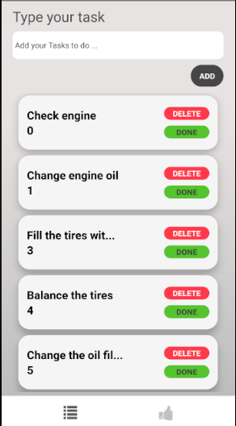

## Purplux Todo list with react native

My github page: [Majid Darvish Nejad](https://github.com/majidux).

## `Step One:`
 Clone the project on your machine
 
Write `npm install` in CMD

## `Step Two : `

After that you need install required libraries

Open your CMD and write these code for installing the libraries

You can use yarn or npm 

Installing redux
`yarn add react-redux redux redux-thunk`

Installing navigation
`yarn add react-navigation react-native-gesture-handler`

Installing vector icons
`yarn add react-native-vector-icons`

## `Step three :`

Link the libraries 

`react-native link react-native-gesture-handler`

`react-native link react-native-vector-icons`

## `Final Step :`
Start the emulator
 
 run the app with this command: `react-native run-android` 
 
## A screen shot of front page

